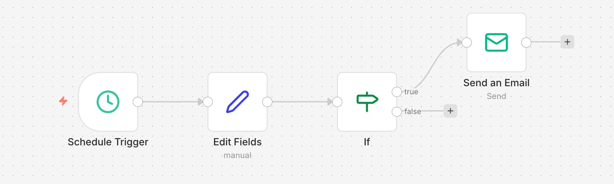
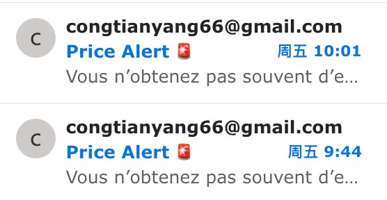

# Duty-Free Price Monitor

A Python scraper + n8n alert system that tracks SKU-level pricing on duty-free e-commerce channels and sends automated email alerts when prices change. Built during my role at L'Oréal Global Travel Retail.

## Background

In Travel Retail, the brand does not directly control retail pricing — instead, it influences retailer promotions through Promotional Allowance (PA) mechanisms. To make data-driven PA decisions, I needed real-time visibility into how duty-free retailers were actually pricing our products versus local market benchmarks.

The challenge: duty-free e-commerce pages often display **multiple size variants on a single product page**, and naive scraping grabs the default (wrong) variant. I had to build a precision scraper that matches the exact target size.

## Architecture

```
┌─────────────────────────────────────────────────────────┐
│  Python Script (price_monitor.py)                       │
│                                                         │
│  1. Fetch product page HTML                             │
│  2. Extract all size variants via regex parsing         │
│  3. Match target size (e.g., "100ml") precisely         │
│  4. Record list_price, sale_price, promo_pct            │
│  5. Append to CSV history with timestamped run_id       │
└──────────────────────┬──────────────────────────────────┘
                       │
                       ▼
┌─────────────────────────────────────────────────────────┐
│  n8n Workflow (Price Alert)                             │
│                                                         │
│  Schedule Trigger (hourly)                              │
│       → Edit Fields (set status + message)              │
│            → If (CHANGE_DETECTED == true)               │
│                 → Send Email (Price Alert 🚨)           │
└─────────────────────────────────────────────────────────┘
```

## The Iteration Story

This project went through three iterations — a useful story for demonstrating real problem-solving:

**V1 — Naive scraper:** Grabbed the first price on the page. Result: captured 50ml price instead of the target 100ml. ❌

**V2 — Inspected HTML:** Discovered that the page embeds variant data as JSON-like objects in a `<script>` block, with fields for `size`, `original_price`, and `final_price`.

**V3 — Precision variant matching:** Built a regex parser to extract all variants, then filter by `target_size`. Now correctly captures the exact SKU. ✅ Added n8n email alert workflow for automated change notifications.

## n8n Alert Workflow



A simple but effective pipeline: scheduled trigger → check for price changes → conditional email alert.

### Email Alert Example



## Sample Output

CSV history file tracks every scrape run with timestamps:

| capture_date | product_name | target_size | currency | list_price | sale_price | promo_pct | status | run_seq |
|---|---|---|---|---|---|---|---|---|
| 2026-04-03 | Mugler Angel EDP | 100ml | USD | 206.0 | 206.0 | 0.0 | ok | 1 |
| 2026-04-03 | Mugler Alien EDP | 90ml | USD | 196.0 | 196.0 | 0.0 | ok | 1 |

## Currently Monitored SKUs

- Mugler Angel EDP 100ml (Boston Duty Free)
- Mugler Alien EDP 90ml (Boston Duty Free)

Designed to be easily extendable — adding a new SKU only requires appending to the `PRODUCTS_TO_MONITOR` list.

## Files

| File | Description |
|------|-------------|
| `price_monitor.py` | Python scraper with variant parsing logic |
| `n8n_alert_workflow.json` | n8n workflow export for email alerts |
| `data/dutyfree_price_history.csv` | Sample output data |
| `screenshots/` | Workflow and alert screenshots |

## Tech Stack

- **Python** — requests, regex, pandas
- **n8n** — Scheduled trigger + conditional email alert
- **SMTP** — Email delivery
