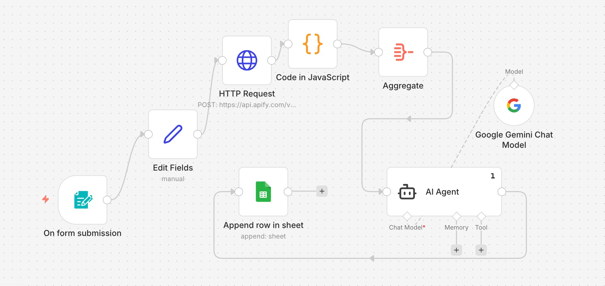
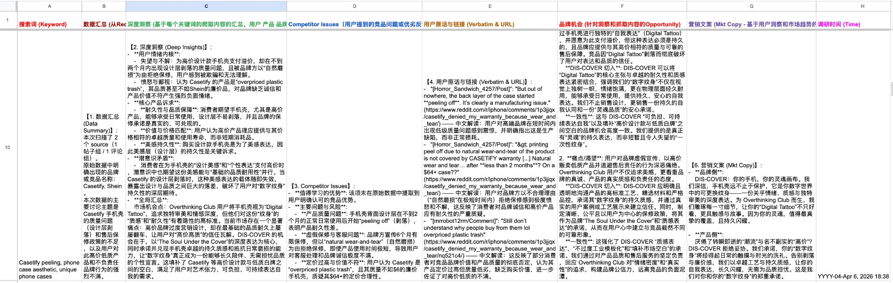

# Reddit Insight Automation

An n8n workflow that turns Reddit conversations into structured brand insights — fully automated from keyword input to a ready-to-use Google Sheet database.

## Background

During a DTC phone case startup project ([DIS-COVER](https://www.dis-cover.co/), ESSEC incubator), I needed to continuously monitor what users on Reddit were saying about phone case brands, quality issues, aesthetics, and purchasing triggers. Doing this manually was slow and inconsistent, so I built an automated pipeline.

## How It Works

### Pipeline

1. **Trigger** — Form submission with target keyword (e.g., "Casetify peeling", "phone case aesthetic")
2. **Edit Fields** — Formats the keyword and sets parameters for the scraper
3. **HTTP Request** — Calls the Apify Reddit Scraper API, fetching posts and comments matching the keyword
4. **Code in JavaScript** — Cleans raw JSON: extracts post title, body, comment text, upvotes, subreddit, and URL; filters noise and deduplicates
5. **Aggregate** — Merges all cleaned items into a single structured payload
6. **AI Agent + Google Gemini** — Sends the aggregated data to a Gemini-powered AI Agent with a detailed prompt, which outputs a **6-dimension insight framework**:
   - **Data Summary** — Volume overview: how many posts/comments scraped, which subreddits, key brands mentioned
   - **Deep Insights** — Underlying user motivations, emotional triggers, and behavioral patterns
   - **Competitor Issues** — Specific complaints and quality/service problems users report about competing brands
   - **Verbatim & URLs** — Direct user quotes with source links for credibility and traceability
   - **Brand Opportunities** — Actionable gaps the brand can exploit based on user pain points
   - **Marketing Copy** — Ready-to-use copy drafts informed by real user language and sentiment
7. **Append Row in Google Sheet** — Writes the full structured output into a centralized brand insight database

### Output: Google Sheet Brand Insight Database

Each row = one keyword research run. Columns map to the 6-dimension framework. The sheet serves as a living, searchable knowledge base that directly feeds product positioning and website copywriting.

## Business Impact

- Reduced manual research time from ~3 hours per keyword to <5 minutes (fully automated)
- Enabled continuous, keyword-driven monitoring of competitor sentiment and user needs
- Directly informed product USP extraction and Wix landing page copy iterations

## Files

| File | Description |
|------|-------------|
| `workflow.json` | n8n workflow export (importable into any n8n instance) |
| `screenshots/` | Workflow canvas and output screenshots |

## Tech Stack

- **n8n** — Workflow orchestration
- **Apify Reddit Scraper** — Data collection via HTTP API
- **JavaScript** — Data cleaning and transformation (inside n8n Code node)
- **Google Gemini** — LLM-powered insight generation (via n8n AI Agent node)
- **Google Sheets** — Structured output storage
